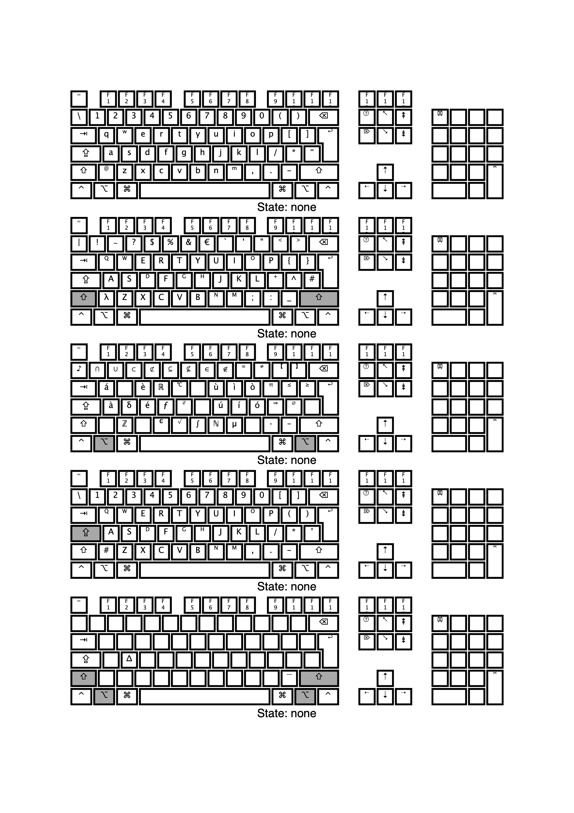

# Italian (Mandriota) Keyboard Layout
Unlike the standart Italian keyboard, this keyboard is convenient for typing parentheses and for programming.

- To write an left accented character (`à`, `è`, `ù`, `ì`, `ò`), just press option + character key.
- To write an right accented character (`é`, `ú`, `í`, `ó`), just press option + below character key (`e` -> `d`; `u` -> `j`; `i` -> `k`; `o` -> `l`). For `á` press option + `q` character key.

